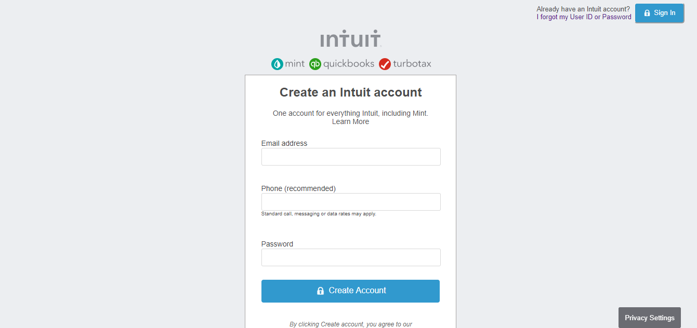

# FORM CLONE

> Microverse Project: A replica of the mint sign-up page

## Built With

- HTML,
- CSS

## Live Demo

[Live Demo Link](https://raw.githack.com/ElijahTobs/HTML-Form/form/index.html)

## Authors

👤 **Elijah Ayandokun**

- Github: [@ElijahTobs](https://github.com/ElijahTobs)
- Twitter: [@Elijahgr8](https://twitter.com/Elijahgr8)
- Linkedin: [linkedin](https://linkedin.com/in/ayandokunelijah)

👤 **Author2**

- Github: [@tGodson](https://github.com/tGodson)
- Twitter: [@tendongze-godson](https://twitter.com/tendongze-godson)
- Linkedin: [linkedin](https://linkedin.com/in/tendongze95)

## 🤝 Contributing

Contributions, issues and feature requests are welcome!

Feel free to check the [issues page](issues/).

## Show your support

Give a ⭐️ if you like this project!

## Acknowledgments

- Hat tip to anyone whose code was used
- Inspiration
- etc

## 📝 License

This project is [MIT](lic.url) licensed.
